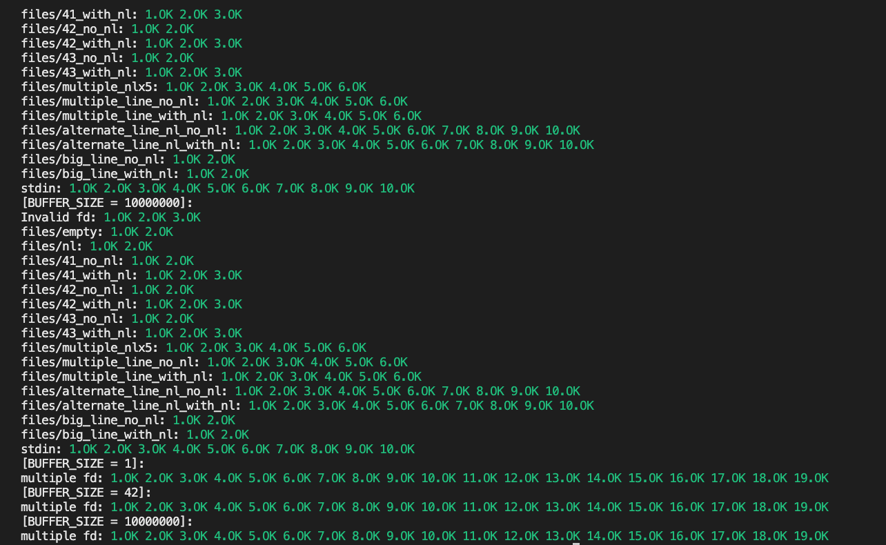

<div align="center" align-items = "center">
	
</div>

---

O projeto get_next_line da escola 42 é onde aprendemos a ler a partir de um descritor de arquivo, bem como o uso de variáveis ​​estáticas. 

Esta função retorna uma única linha de um determinado descritor de arquivo. Se chamado em um loop, get_next_line retorna todo o conteúdo de um arquivo, linha por linha, até chegar ao final do arquivo. Ele pode ser compilado especificando qualquer tamanho de buffer. 


---

<br>

## Uso 
Esta função não é um programa autônomo, seus arquivos devem ser incluídos e compilados dentro de outro projeto. 

Exemplo ``main.c``: 
```c 
#include <stdio.h> 
#include <fcntl.h> 
#include <unistd.h> 
#include "get_next_line.h" 

int    main(void)
{
    int    fd;

    fd = open("texto.txt", O_RDWR);
    
    if (fd == -1)
        return (-1);

    printf("%s\n", get_next_line(fd));
    close(fd);

    printf("%i", fd);
    return (0);
}
``` 
Compilação: 
```bash 
gcc main.c get_next_line.c get_next_line_utils.c 
``` 
``BUFFER_SIZE`` pode ser especificado na compilação para substituir o padrão ``BUFFER_SIZE``: 
```bash 
gcc -D BUFFER_SIZE=42 main.c get_next_line.c get_next_line_utils.c 
``` 
Execução: 
```bash 
./a.out [file] 
``` 
A saída deve mostrar todo o conteúdo do arquivo fornecido. 
<br><br>

## Uso de teste automatizado

Você pode utilizar este repositório para testar seu projeto

```bash
git clone https://github.com/Tripouille/gnlTester.git
```

#### Após utilizar o teste, terá essa aparência:
---

<div align="center">
	
</div>

---

Estando tudo ok, seu projeto foi feito com excelência e sem vazamento de memória. 